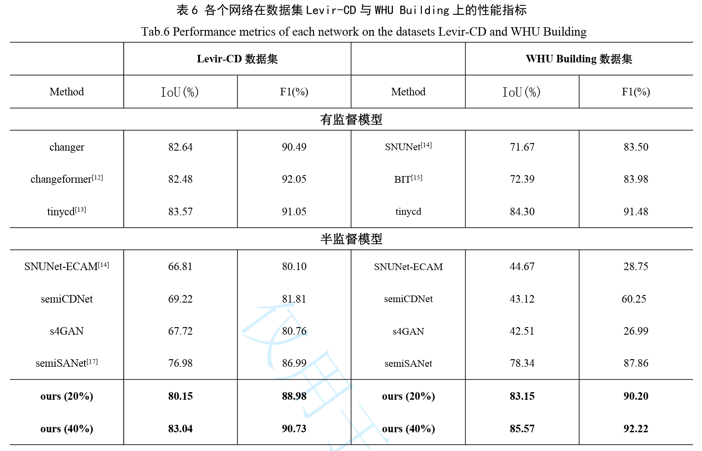
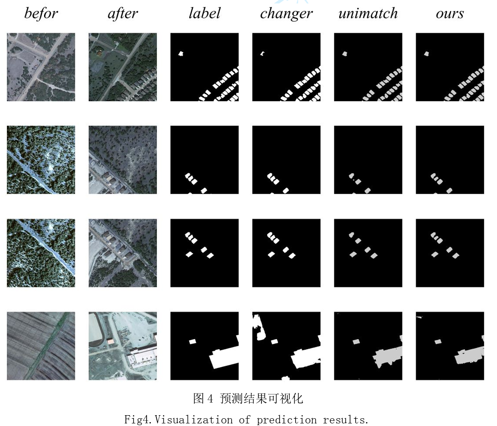

# 环境
torch                          1.11.0+cu113

torchvision                    0.12.0

mmcv                           2.0.1

mmdet                          3.2.0

mmengine                       0.10.1

mmsegmentation                 1.2.1

python                         3.10

# 性能指标
| 模型    | levir-cd(IoU%) | WHU Building(IoU%) |
|---------|:--------------:|--------------------|
| [changer](https://ieeexplore.ieee.org/document/10129139) | 82.64          | 71.67              |
| [tinycd](https://arxiv.org/abs/2207.13159)  | 83.57          | 84.30              |
| ours    | 83.04          | 85.57              |

# 运行
训练
```
python tools/train.py configs\changer\changer_semi_mit-b0_512x512_40k_levircd.py
```

测试
```
python tools/test.py configs\changer\changer_semi_mit-b0_512x512_40k_levircd.py {weight_path}
```

部署
参考mmdeploy

# 结果


